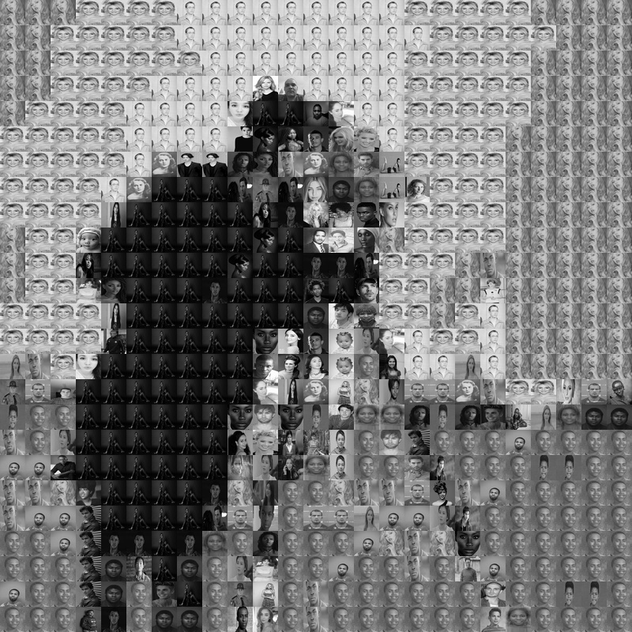
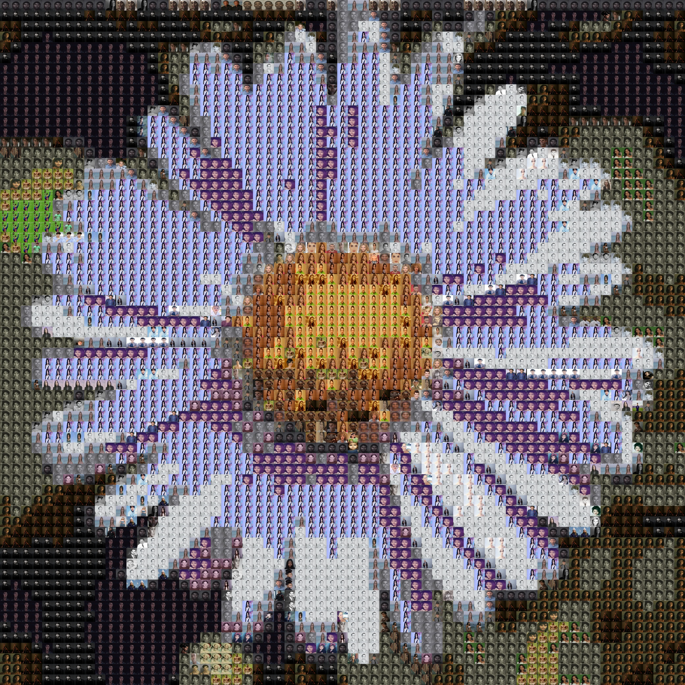

# imageimage

A Python program that converts images into image representations.

> [!WARNING]
> What?

Yeah, I mean, mosaics, like this:

<table border="1" align="center">
  <tr>
    <th>Original image</th>
    <th>Mosaic</th>
  </tr>
  <tr>
    <td></td>
    <td></td>
  </tr>
  <tr>
    <td></td>
    <td></td>
  </tr>
  <tr>
    <td></td>
    <td></td>
  </tr>
</table>

---

# Example of usage:

Clone the project:
```bash
git clone https://github.com/agarnung/imageimage.git
```

Install required dependencies (it is recommended tu use a virtual environment):
```bash
python3 -m pip install -r requirements.txt
```

> ![NOTE]
> Requirements generated with `pipreqs . --force`

Run the program in the root folder, e.g.:
```bash
python3 imageimage.py --file /home/alejandro/Pictures/lena.png --inputs ./image_database --out ./results 
```

Please refer to the program help:
```bash
python3 imageimage.py --help
```

---

# References:

- Inspired by [this](https://susanqq.github.io/UTKFace/icon/logoWall2.jpg) and [this](https://github.com/agarnung/asciimage/tree/main).

